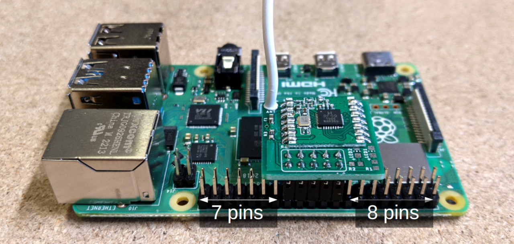
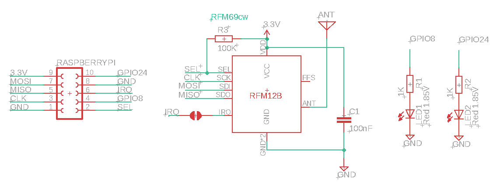

# New: emonBase with RFM69 SPI (Direct)

## Overview

The latest emonBase comes with a new direct SPI RFM69 adapter board. Previously we had an ATmega328 microcontroller as an intermediary between the RFM69 module and the RaspberryPi, this was required for the JeeLib Classic radio format. With the switch to using the LowPowerLabs radio format a direct SPI connection is now possible and provides other benefits in terms of radio module configurability. For more detail on the different radio formats see [emonTx4: rfm69-radio](https://docs.openenergymonitor.org/emontx4/technical.html#rfm69-radio).



If the RFM69 SPI module is bought as part of an emonBase through our shop, the module will already be installed on the Raspberry Pi. The Raspberry Pi will also come installed in a nice wall mountable aluminium enclosure. See shop item images: [https://shop.openenergymonitor.com/emonbase-433mhz-rfm69spi](https://shop.openenergymonitor.com/emonbase-433mhz-rfm69spi/).

## Mounting the RFM69 SPI module

**Important:** The position of the RFM69 SPI module on the Raspberry Pi header pins is different to the original RFM69Pi board. The SPI pins are part way along the Raspberry Pi GPIO header. The board should be mounted so that there are 7 pins free between the board and the Ethernet socket to the left and 8 pins free to the right, as shown in the picture above. **Take special care to get the position right as the board could be damaged in the wrong position.**

## EmonHub Interfacer

Radio packets received by the RFM69 SPI board are read using what is called an `Interfacer` in a piece of software called `emonHub` that runs on the RaspberryPi. The interfacer is called `EmonHubRFM69LPLInterfacer` and makes use of [our modifed version](https://github.com/openenergymonitor/rpi-rfm69) of the [jgillula/rpi-rfm69 library](https://github.com/jgillula/rpi-rfm69).

This library is installed as standard on the latest emonSD image (`emonSD-10Nov22` onwards), it will also install automatically if an older emonSD image is upgraded by running 'Full Update' in Admin>Update.

If you are adding an RFM69 SPI board to an existing install you will need to add the following interfacer configuration entry in the interfacers section of emonhub.conf to enable reading from this board:

```
[interfacers]
    [[SPI]]
        Type = EmonHubRFM69LPLInterfacer
        [[[init_settings]]]
            nodeid = 5
            networkID = 210
            selPin = 26
        [[[runtimesettings]]]
            pubchannels = ToEmonCMS,
```

This configuration is included by default on the latest emonSD image (`emonSD-10Nov22` onwards).

## Enable SPI 

The SPI interface on on the RaspberryPi must be enabled to use the RFM69 SPI, this is enabled by default on the latest emonSD image (`emonSD-10Nov22` onwards) and will be automatically enabled to older images by running 'Full Update' in Admin>Update. To manually enable SPI connect via SSH and run `sudo raspi-config` and select `SPI` under `Interface Options`. Or alterantivly uncomment `dtparam=spi=on` in `/boot/config.txt`. 

## Radio encryption key

The encryption key for the RFM69 is currently hard coded in the EmonHubRFM69LPLInterfacer. This will be broken out as an emonhub.conf configuration option soon. If you would like to change the encryption key to make it secure, this can be done by modifying the  `encryptionKey` setting on line 51 of the EmonHubRFM69LPLInterfacer itself: [https://github.com/openenergymonitor/emonhub/blob/master/src/interfacers/EmonHubRFM69LPLInterfacer.py#L51](https://github.com/openenergymonitor/emonhub/blob/master/src/interfacers/EmonHubRFM69LPLInterfacer.py#L51).

## Open Hardware

The RFM69 SPI Board is open hardware. The Eagle schematic and board files are available here: [https://github.com/openenergymonitor/emonbase/tree/main/rfm69-spi](https://github.com/openenergymonitor/emonbase/tree/main/rfm69-spi)

**Schematic:**



**Board:**

```{image} img/rfm69-spi-board.png
:alt: board
:class: bg-primary
:width: 300px
:align: left
```
